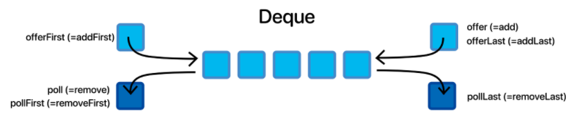

## Deque

### 덱(Deque)이란?

- **Double-Ended Queue** 의 줄임말로 **큐의 양쪽에서 데이터를 삽입과 삭제를 할 수 있는 자료 구조**

### 덱 사용법
- Java에서 덱은 **인터페이스**로 구현되어있다. Deque 인터페이스가 있고 이를 구현한 **ArrayDeque, LinkedBlockingDeque, ConcurrentLinkedDeque, LinkedList** 등의 클래스가 있다.

|메소드|설명|
|-----|---|
|addFirst()|덱의 맨 앞에 전달된 요소를 삽입한다. 용량 제한이 있는 덱의 경우, 용량 초과시 예외가 발생한다.|
|addLast()|덱의 맨 뒤에 전달된 요소를 삽입한다. 용량 제한이 있는 덱의 경우, 용량 초과시 예외가 발생한다. add()와 같다.|
|offerFirst()|덱의 맨 앞에 전달된 요소를 삽입한다. 정상적으로 요소가 삽입된 경우 true가 반환되며, 용량 제한에 걸리는 경우 false를 반환한다.| 
|offerLast()|덱의 맨 뒤에 전달된 요소를 삽입한다. 정상적으로 요소가 삽입된 경우 true가 반환되며, 용량 제한에 걸리는 경우 false를 반환한다. offer()와 같다.|
|removeFirst()|덱의 맨 앞에 있는 요소 하나를 뽑아서 제거한 다음 반환한다. 덱이 비어있으면 예외가 발생한다. remove()와 같다.|
|removeLast()|덱의 맨 뒤에 있는 요소 하나를 뽑아서 제거한 다음 반환한다. 덱이 비어있으면 예외가 발생한다.|
|pollFirst()|덱의 맨 앞에서 요소 하나를 뽑아서 제거한 다음 반환한다. 덱이 비어있으면 null이 반환된다. poll()과 같다.|
|pollLast()|덱의 맨 뒤에서 요소 하나를 뽑아서 제거한 다음 반환한다. 덱이 비어있으면 null이 반환된다.|
|getFirst()|덱의 맨 앞 요소를 반환한다. 덱이 비어있으면 예외가 발생한다|
|getLast()|덱의 맨 뒤 요소를 반환한다. 덱이 비어있으면 예외가 발생한다.|
|peekFirst()|덱의 맨 앞 요소를 반환한다. 덱이 비어있으면 null이 반환된다. peek()과 같다.|
|peekLast()|덱의 맨 뒤 요소를 반환한다. 덱이 비어있으면 null이 반환된다.|

### 출처
- https://crazykim2.tistory.com/581
- https://st-lab.tistory.com/185