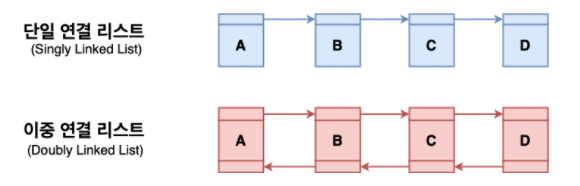

## LinkedList

### 링크드리스트(LinkedList)란?
  
- **각 노드가 데이터와 포인터를 가지고 한 줄로 연결되어 있는 방식**으로 데이터를 저장하는 자료 구조

### 링크드리스트 장단점
#### 장점
- 동적할당을 하기 떄문에 선언시 크기를 지정하지 않아도 되어 **메모리를 효율적으로 사용할 수 있다.**
- 데이터의 추가 또는 삭제가 용이하다.

#### 단점
- **데이터를 찾을 때 처음부터 순차적으로 접근한다.** 따라서 비순차적인 데이터의 추가 또는 삭제에 시간이 많이 걸린다. **검색은 O(n)의 시간 복잡도를 가진다.**
- 실행 속도 향상을 위해서는 처음부터 큰 배열을 생성해야 하기 때문에 메모리가 낭비된다.

### 링크드리스트 사용법 
- **Java에는 링크드리스트 라이브러리가 있다.**(import java.util.LinkedList)
- Java에서 링크드리스트는 **더블링크드리스트**로 구현되어 있다.
- 링크드리스트로 Queue 인터페이스와 Deque 인터페이스도 구현하였기 때문에, 해당 인터페이스에서 사용하는 명령어도 사용할 수 있다. (Queue, Deque 참고)

|메소드|설명|
|-----|---|
|get()|지정된 위치의 객체를 반환한다.|
|subList(int fromIndex, int toIndex)|LinkedList의 일부를 List로 반환한다.|
|add()|지정된 객체를 LinkedList의 끝에 추가한다. 성공시 true를 반환한다.|
|add(ind index, Object element)|지정된 위치에 객체를 추가한다.|
|addAll()|주어진 컬렉션의 모든 객체를 마지막 index 뒤로 추가한다. 성공하면 true를 반환한다.|
|addAll(int index, Collection c)|주어진 컬렉션의 모든 객체를 index부터 추가한다. 성공하면 true를 반환한다..|
|set(int index, Object element)|지정된 위치의 객체를 주어진 객체로 바꾼다.|
|remove(int index)|지정된 위치의 객체를 LinkedList에서 제거한다.|
|remove(Object o)|지정된 객체를 LinkedList에서 제거한다. 성공하면 true를 반환한다.|
|removeAll()|지정된 컬렉션의 요소와 일치하는 요소를 모두 삭제한다.|
|retainAll()|지정된 컬렉션의 모든 요소가 포함되어 있는지 확인한다.|
|clear()|LinkedList의 모든 요소를 삭제한다.|
|size()|LinkedList에 저장된 객체의 수를 반환한다.|
|isEmpty()|LinkedList가 비어있는지 알려준다. 비어있으면 true를 반환한다.|
|contains()|지정된 객체가 LinkedList에 포함되었는지 알려준다.|
|containsAll()|지정된 컬렉션의 모든 요소가 포함되었는지 알려준다.|
|indexOf()|지정된 객체가 앞에서부터 몇 번째로 저장되어 있는지 순서를 반환한다.|
|lastIndexOf()|지정된 객체가 뒤에서부터 몇 번째로 저장되어 있는지 순서를 반환한다.|
|iterator()|Iterator를 반환한다.|
|listIterator()|ListIterator를 반환한다.|
|listIterator(int index)|지정된 위치에서부터 시작하는 ListIterator를 반환한다.|
|toArray()|LinkedList에 저장된 객체를 배열로 반환한다.|
|toArray(Object[] a)|LinkedList에 저장된 객체를 주어진 배열에 저장하여 반환한다.|

---
### 출처
- https://beccacatcheserrors.tistory.com/36