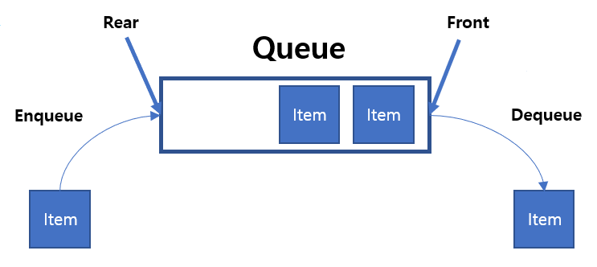

## Queue

## 큐(Queue)란?

- 먼저 집어 넣은 데이터가 먼저 나오는 FIFO(First In First Out) 형식의 자료 구조

## 큐 사용법
- Java에는 큐 라이브러리가 있다. (import java.util.Queue)
- 큐에 데이터를 추가, 삭제, 검색할 때 사용되는 유사한 메서드들이 있다. 이들은 문제 상황에서 예외를 발생시키는지, 아니면 null이나 false를 반환하는지에 따라 분류된다. 

|메소드|설명| 
|-----|---| 
|add()|해당 큐의 맨 뒤에 전달된 요소를 삽입한다.삽입에 성공하면 true를 반환하고, 큐에 여유 공간이 없어 삽입에 실패하면 예외를 발생시킨다.|
|offer()|해당 큐의 맨 뒤에 전달된 요소를 삽입한다.|
|remove()|해당 큐의 맨 앞에 있는 요소를 제거한다.|
|poll()|해당 큐의 맨 앞에 있는 요소를 반환하고, 해당 요소를 큐에서 제거한다. 큐가 비어있으면 null을 반환한다.|
|element()|해당 큐의 맨 앞에 있는 요소를 반환한다.|
|peek()|해당 큐의 맨 앞에 있는 요소를 반환한다. 큐가 비어있으면 null을 반환한다.|

### 큐 구현
#### 배열로 큐 구현
```java
public class ArrQueue {
    int front;
    int rear;
    int size;
    String[] arr;

    public ArrQueue(int size) {
        front = -1;                  //front값 초기화
        rear = -1;                   //rear값 초기화
        arr = new String[size];
        this.size = size;
    }

    public void enqueue(String data) {
        if (rear == size - 1) {
            throw new IllegalStateException();
        }
        arr[++rear] = data;
    }

    public String dequeue() {                   //poll
        if (front == rear) {
            return null;
        }
        String s = arr[++front];                //arr[0]값 추출
        for (int i = 0; i < size - 1; i++) {    //for문을 통해 배열을 한 칸씩 앞으로 당겨준다. 
            arr[i] = arr[i + 1];
        }
        arr[size - 1] = null;                   //dequeue 후 배열의 마지막 값은 비어있어야한다.
        front--;
        rear--;
        return s;
    }

    public String peek() {
        if (front == rear) {
            return null;
        }
        return arr[0];
    }

    public boolean isEmpty() {
        if (front == rear) {
            return true;
        } else {
            return false;
        }
    }

    public void printArr() {
        System.out.println("Queue front");
        for (int i = 0; i < size; i++) {
            System.out.println(arr[i]);
        }
        System.out.println("Queue rear");
    }
}
```
---
### 출처
큐 사용법: http://tcpschool.com/java/java_collectionFramework_stackQueue