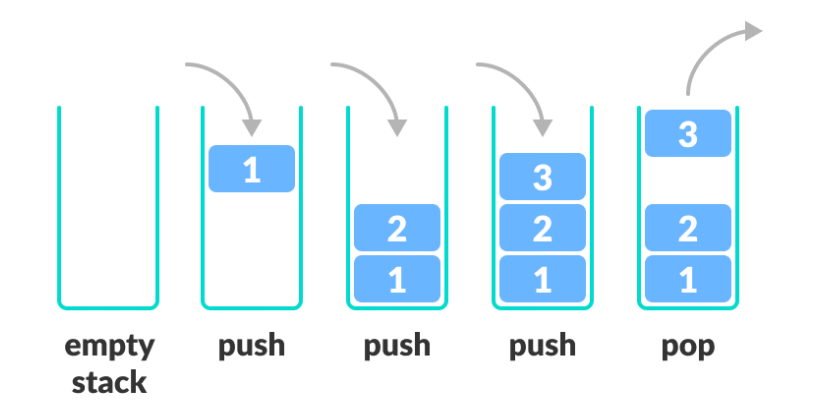

## Stack

### 스택(Stack)이란?



- 한 쪽 끝에서만 자료를 넣고 뺄 수 있는 **LIFO(Last In First Out)** 형식의 자료 구조

### 스택 사용법

- **Java에는 스택 라이브러리가 있다.** (import java.util.Stack)
- **push()**: 스택의 가장 위에 데이터를 삽입한다.
- **pop()**: 스택의 가장 위에 있는 데이터를 반환하고 삭제한다.
- **peek()**: 스택의 가장 위에 있는 데이터를 반환한다.
- **isEmpty()**: 스택이 비어 있을 때에 true를 반환한다.
- **size()**: 스택에 쌓여있는 데이터의 갯수를 반환한다.

### 스택 구현
#### 배열로 스택 구현

```java
public class ArrStack {
    int top;
    int size;
    String[] arr;

    public ArrStack(int size) {
        top = -1;               //top의 값 초기화
        arr = new String[size];
        this.size = size;
    }

    public void push(String data) {
        if (top == arr.length - 1) {
            throw new StackOverflowError();
        }
        arr[++top] = data;
    }

    public String pop() {
        if (top == -1) {
            throw new ArrayIndexOutOfBoundsException();
        }
        return arr[top--];
    }

    public String peek() {
        if (top == -1) {
            throw new ArrayIndexOutOfBoundsException();
        }
        return arr[top];
    }

    public boolean isEmpty() {
        if (top == -1) {
            return true;
        } else {
            return false;
        }
    }

    public void printArr() {
        System.out.println("Stack Top");
        for (int i = top; i > -1; i--) {
            System.out.println(arr[i]);
        }
        System.out.println("Stack Bottom");
    }
}
```